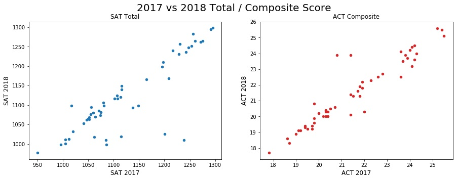
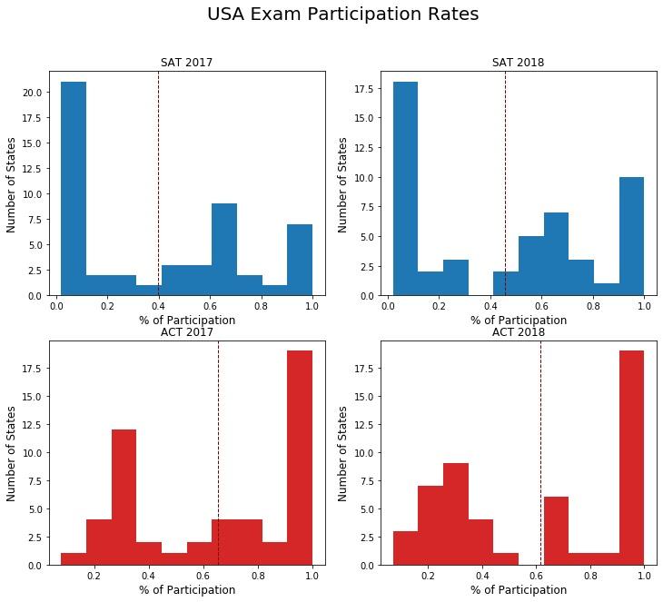
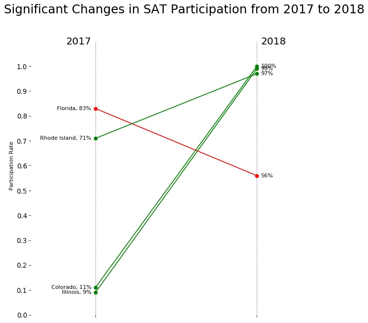

# Standardized Testing, Statistical Summaries and Inference
# Analysing trends to improve participation rates in SAT and ACT examination for the United States
## Introduction

> Despite the growing economy, participation rates for College Entrance Exams such as the SAT and ACT are still at a low for many states. With jobs and roles evolving in the work force, the new generation are expected to be equipped with the relevant skills obtained mainly from tertiary education. Hence, attending the entrance exams is the first step for students and we aim to provide recommendations on how to improve rates, particularly for states with lower percentages of participation for both exams.

## Contents:
- [Technologies](#technologies)
- [Description of Data](#datasummary)
- [Key Findings](#keyfindings)
- [Outside Research](#outsideresearch)
- [Conclusions and Recommendations](#conclusion)
---

## Technologies
Project is created with:
* Pandas version: 0.25.1
* NumPy version: 1.16.5
* Seaborn version: 0.9.0
* Matplotlib version: 3.1.1
* SciPy version: 1.3.1

## Datasets
Raw datasets extracted:
- [2017 SAT Scores](../data/sat_2017.csv)
- [2017 ACT Scores](../data/act_2017.csv)
- [2018 SAT Scores](../data/sat_2018.csv)
- [2018 ACT Scores](../data/act_2018_updated.csv)

#### Final cleansed dataset:

- [2017 / 2018 SAT and ACT Scores](../data/final.csv)

##### Summary of Data

| Feature | Type | Dataset | Description |
| --- | --- | --- | --- |
| **state** | *object* | final | The names of the 50 states of the USA |
| **sat_2017_participation** | *float* | final | The SAT 2017 participation rate of each state by % (e.g. 0.4 = 40%) |
| **sat_2017_erw** | *integer* | final | The score for SAT 2017 Evidence-Based Reading & Writing |
| **sat_2017_mth** |	*integer* |	final	| The score for SAT 2017 Math |
| **sat_2017_total** |	*integer* |	final	| The total score for SAT 2017 |
| **act_2017_participation** |	*float* |	final	| The ACT 2017 participation rate of each state by % (e.g. 0.4 = 40%) |
| **act_2017_eng** |	*float* |	final	| The score for ACT 2017 English |
| **act_2017_mth** |	*float* |	final	| The score for ACT 2017 Math |
| **act_2017_rdg** |	*float* |	final	| The score for ACT 2017 Reading |
| **act_2017_sci** |	*float* |	final	| The score for ACT 2017 Science |
| **act_2017_composite** |	*float* |	final	| The composite score for ACT 2017 |
| **sat_2018_participation** |	*float* |	final	| The SAT 2018 participation rate of each state by % (e.g. 0.4 = 40%) |
| **sat_2018_erw** |	*integer* |	final	| The score for SAT 2018 Evidence-Based Reading & Writing |
| **sat_2018_mth** |	*integer* |	final	| The score for SAT 2018 Math |
| **sat_2018_total** |	*integer* |	final	| The total score for SAT 2018 |
| **act_2018_participation** |	*float* |	final	| The ACT 2018 participation rate of each state by % (e.g. 0.4 = 40%) |
| **act_2018_composite** |	*float* |	final	| The score for ACT 2018 English |
| **act_2018_eng** |	*float* |	final |	The score for ACT 2018 Math |
| **act_2018_mth** |	*float* |	final |	The score for ACT 2018 Reading |
| **act_2018_rdg** |	*float* |	final |	The score for ACT 2018 Science |
| **act_2018_sci** |	*float* |	final |	The composite score for ACT 2018 |

---

## Key Findings
#### Score Trends:

Below is a graph indicating the trend of each state (represented by dots) and their consistency in scores for both SAT Total and ACT Composite:

There is a clear correlation between the two years for both exams. States which performed well for SAT in 2017 performed well for 2018 as well, where the same applies to ACT. States which performed poorly for one exam also performed poorly for the same exam the following year.

**3 states** performed the **poorest** for **SAT 2017 and 2018**, these states are:
* District of Columbia, Delaware, Idaho and Michigan
* These states have **participation rates of 100%**
* Colorado's mean score dropped from 1201 to 1025

**2 states** performed the **poorest** for **ACT 2017 and 2018**, these states are:
* Nevada and Mississippi
* These states have **participation rates of 100%**

#### Participation Rate Trends:
We observed the Participation Rates for SAT and ACT in 2017 and 2018:

Based on the four graphs, we can deduce that ACT is the more popular exam, some states also have preference on taking only one of the two exams in a year (with exceptions of certain states that have high participation in both exams).

* Over **20 States** have participation **below the average rate** of 40% for **SAT** in 2017 and 2018
* Over **20 States** have participation **above 90%** for **ACT** in 2017 and 2018

Below are line graphs depicting states with a high percentage of changes in participation rate for each particular exam in a span of one year:

From the line chart, we can see that Colorado and Illinois have greatly increased their participation for SAT. The mean score from 2017 to 2018 has increased which are likely contributed from these two states.

As expected from the inverse relation, Colorado and Illinois' participation for ACT has decreased as rates increased for SAT. There appears to be more states moving out of ACT. However, Nebraska and Ohio have shifted to a 100% participation rate for ACT in 2018 from 84% and 75% respectively.

---

## Outside Research

Based on our research and observations, the three states that we are particularly interested in are Colorado, Illinois and Nebraska.

**Colorado**

Colorado SAT participation rates **increased from 11% to 100%**. This is due to the state making it **mandatory** for students to sit for SAT after a drastic change in the education system to align the standards of SAT with the states' education values. As a result ACT participation rate had decreased from 100% to 30%.

**Illinois**

We saw a massive increate in participation for SAT in Illinois from 9% to 99% in just one year. This is due to Illinois awarding SAT a multi-million dollar contract as a part of their plan to **improve school standards** and help underperforming schools. With this, the participation rates for ACT in 2018 dropped drastically to 43% from 93%.

This results in **schools paying for students' exam entrance** fees of $50 which not all families are able to afford.

**Nebraska**

The state of Nebraska saw an increase in participation rate from 84% to 100%. This is due to Nebraska offering the **ACT for free** to all juniors from 2017 onwards. As student loans are generally very expensive, this is an understandable increase to **encourage students to take the ACTs**. Additionally, Nebraska has appeared to **score better** than other states who have 100% participation which may indicate a relation for free admissions on participation rates as well as composite performance.

---

## Conclusions and Recommendations

##### Free Admissions
Based on our research on states that reflect a drastic improvement in participation rates such as Illinois and Nebraska. We deduced that **offering free admissions** would greatly encourage higher participation as well as potentially **improving total / composite scores**. Potentially there are many individuals who did not sit for the exam, not by choice, but because they may be unable to afford it.

##### Recommended States
###### Lowest collective participation rates (%) in 2018:
| State | SAT | ACT |
| --- | --- | --- |
| **Vermont** | 64% | 24% |
| **Virginia** | 68% | 24% |
| **Washington** | 69% | 24% |
| **California** | 60% | 27% |
| **Indiana** | 63% | 32% |

We recommend states such as **Washington**, **California**, **Vermont**, **Virginia** and **Indiana** with poor participation rates for both SAT and ACT in 2018, to consider **making exam admissions more accessible and affordable** for students. States like **California** also have a **large population** and the low percentage of participation of 60% and 27% for SAT and ACT respectively amounts to a large population of the United States.

##### Additional Info Required
To help improve our findings, data such as **per capita GDP** for each state will help us target which states are greatly in need of financial assistance to improve the education system as well as giving all students in every state equal opportunity.
