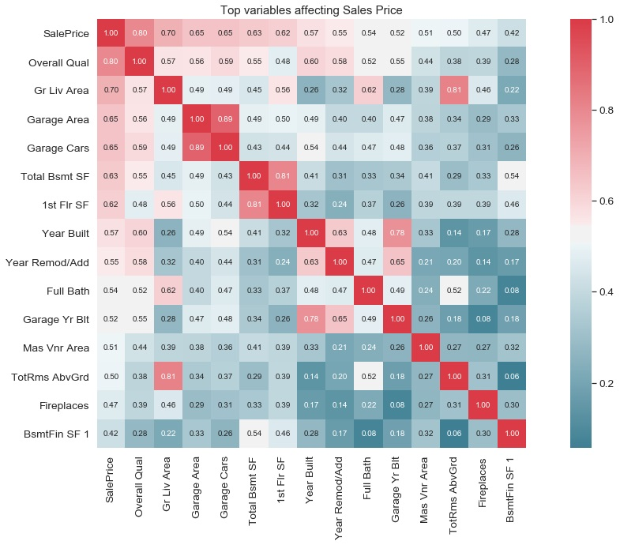
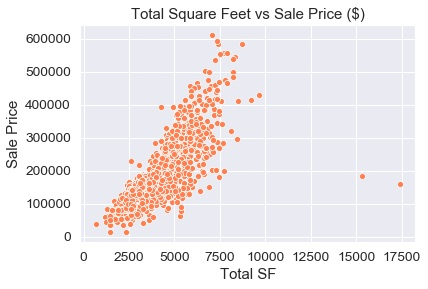
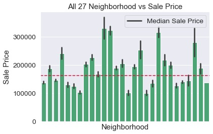
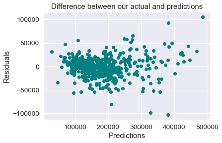

# Ames Housing Data and Kaggle Challenge
# Analysing features in a house that affect sale price
## Introduction

> House prices are always a thing of speculation, with many factors affecting it's value. Citizens struggle to find a house that fulfils their needs and wants which is within their budget. We aim to assess what factors greatly affect sale price of a house so that we can build a model which will in turn predict the potential prices (citizen's budget) for future unsold houses (citizen's needs / wants).

## Contents:
- [Technologies](#technologies)
- [Description of Data](#datasets)
- [Exploratory Data Analysis](#eda)
- [Model Fitting and Evaluation](#outside-research)
- [Conclusion](#conclusion)
---

## Technologies
Project is created with:
* Pandas version: 0.25.1
* NumPy version: 1.16.5
* Seaborn version: 0.9.0
* Matplotlib version: 3.1.1
* Scikit-learn version: 0.21.3

## Datasets
Raw datasets extracted:
- [Training Data](../data/train.csv)
- [Test Data](../data/test.csv)

Final predictions on test data:

- [Submission Data](../data/submission.csv)

##### Summary of Data
Below is a quick summary of each column feature. An even more in-depth look can be found [here](http://jse.amstat.org/v19n3/decock/DataDocumentation.txt).

Numerical

| Feature | Type | Dataset | Description |
| --- | --- | --- | --- |
| **Id** | *integer* | train / test | House identification number |
| **PID** | *integer* | train / test | Parcel identification number |
| **Lot Frontage** | *float* | train / test | Linear feet of street connected to property |
| **Lot Area** | *integer* | train / test | Lot size in square feet |
| **Overall Qual** | *integer* | train / test | Overall quality of the house |
| **Overall Cond** | *integer* | train / test | Overall condition of the house |
| **Year Built** | *integer* | train / test | Year Built |
| **Year Remod/Add** | *integer* | train / test | Year Remodelled |
| **Mas Vnr Area** | *float* | train / test | Masonry area in square feet |
| **BsmtFin SF1** | *float* | train / test | Basement Type 1 finished square feet |
| **BsmtFin SF2** | *float* | train / test | Basement Type 2 finished square feet |
| **Bsmt Unf SF** | *float* | train / test | Unfinished square feet of basement area |
| **1st Flr SF** | *integer* | train / test | First floor square feet |
| **2nd Flr SF** | *integer* | train / test | Second floor square feet |
| **Low Qual Fin SF** | *integer* | train / test | Low quality finished square feet (all floors) |
| **Gr Liv Area** | *integer* | train / test | Above grade (ground) living area square feet |
| **Bsmt Full Bath** | *float* | train / test | Full bath in basement |
| **Bsmt Half Bath** | *float* | train / test | Half bath in basement |
| **Full Bath** | *integer* | train / test | Full bath in house |
| **Half Bath** | *integer* | train / test | Half bath in house |
| **Bedroom AbvGr** | *integer* | train / test | Bedroom above grade |
| **Kitchen AbvGr** | *integer* | train / test | Kitchen above grade |
| **TotRms AbvGrd** | *integer* | train / test | Total rooms above grade (excluding bathrooms) |
| **Fireplaces** | *integer* | train / test | Number of fireplaces |
| **Garage Yr Blt** | *float* | train / test | Garage year built |
| **Garage Cars** | *float* | train / test | Size of garage in car capacity |
| **Garage Area** | *float* | train / test | Square feet of garage |
| **Wood Deck SF** | *integer* | train / test | Square feet of wood deck |
| **Open Porch SF** | *integer* | train / test | Square feet of open porch |
| **Enclosed Porch** | *integer* | train / test | Square feet of enclosed porch |
| **3Ssn Porch** | *integer* | train / test | Square feet of three season porch |
| **Screen Porch** | *integer* | train / test | Square feet of screen porch |
| **Pool Area** | *integer* | train / test | Square feet of pool |
| **Misc Val** | *integer* | train / test | Parcel identification number |
| **Mo Sold** | *integer* | train / test | Value of miscellaneous feature in dollars |
| **Yr Sold** | *integer* | train / test | Year house sold |
| **SalePrice** | *integer* | train / test | Sale price of house |

Non-numerical

| Feature | Type | Dataset | Description |
| --- | --- | --- | --- |
| **MS SubClass** | *object* | train / test | Identifies the type of dwelling involved in the sale |
| **MS Zoning** | *object* | train / test | Identifies the general zoning classification of the sale |
| **Street** | *object* | train / test | Type of road access to property |
| **Lot Shape** | *object* | train / test | General shape of property |
| **Land Contour** | *object* | train / test | Flatness of the property |
| **Utilities** | *object* | train / test | Type of utilities available |
| **Lot Config** | *object* | train / test | Lot configuration |
| **Land Slope** | *object* | train / test | Slope of property |
| **Neighborhood** | *object* | train / test | Physical locations within Ames city limits |
| **Condition 1** | *object* | train / test | Proximity to various conditions |
| **Condition 2** | *object* | train / test | Proximity to various conditions (if more than one is present) |
| **Bldg Type** | *object* | train / test | Type of dwelling |
| **House Style** | *object* | train / test | Style of dwelling |
| **Roof Style** | *object* | train / test | Type of roof |
| **Roof Matl** | *object* | train / test | Roof material |
| **Exterior 1st** | *object* | train / test | Exterior covering on the house |
| **Exterior 2nd** | *object* | train / test | Exterior covering on the house (if more than one material) |
| **Mas Vnr Type** | *object* | train / test | Masonry veneer type |
| **Exter Qual** | *object* | train / test | Evaluates the quality of the material on the exterior  |
| **Exter Cond** | *object* | train / test | Evaluates the present condition of the material on the exterior |
| **Foundation** | *object* | train / test | Type of foundation |
| **Bsmt Qual** | *object* | train / test | Evaluates the height of the basement |
| **Bsmt Cond** | *object* | train / test | Evaluates the general condition of the basement |
| **Bsmt Exposure** | *object* | train / test | Refers to walkout or garden level walls |
| **BsmtFin Type 1** | *object* | train / test | Rating of basement finished area |
| **BsmtFin Type 2** | *object* | train / test | Rating of basement finished area (if multiple types) |
| **Heating** | *object* | train / test | Type of heating |
| **Heating QC** | *object* | train / test | Heating quality and condition |
| **Central Air** | *object* | train / test | Central air conditioning |
| **Electrical** | *object* | train / test | Electrical system |
| **Kitchen Qual** | *object* | train / test | Kitchen quality |
| **Functional** | *object* | train / test | Home functionality (Assume typical unless deductions are warranted) |
| **Garage Type** | *object* | train / test | Garage location |
| **Garage Finish** | *object* | train / test | Interior finish of the garage |
| **Garage Qual** | *object* | train / test | Garage quality |
| **Garage Cond** | *object* | train / test | Garage condition |
| **Paved Drive** | *object* | train / test | Paved driveway |
| **Sale Type** | *object* | train / test | Type of sale |
| **Pool QC** | *object* | train / test | Pool quality |
| **Misc Feature** | *object* | train / test | Miscellaneous feature not covered in other categories |
| **Alley** | *object* | train / test | Type of alley access to property |
| **Fence** | *object* | train / test | Fence quality |
| **Fireplace Qu** | *object* | train / test | Fireplace quality |

---

## Exploratory Data Analysis
#### Correlation to sale price:

We look at the heatmap to assess the top variables in correlation to sale price:

* **Space in general** contributes to higher price as the basement and 1st floor square feet have a **high positive correlation above 60%**
* The size of the **garage** greatly affects sales price with the area and car space greatly contributing to the influence. We will **create a total square feet column** which includes the area of other living areas in the house as well to represent the space feature
* The higher the **Overall Quality** of the house greatly increases sales price, representing a **correlation of 80%**
* Higher number of **year built** has a **correlation above 50%**. This could be interpretted as newer houses built (e.g. 2005 vs 2010) carry a larger sale price perhaps due to a smaller age of the house. Based on this, we will create an age column as we can infer that younger houses will fetch a higher sale price
* As year **remodelled has a positive correlation of 55%** with sale price, we will create a column of categorical variables that represents whether a house has been remodelled

#### Square feet relation to sale price:

Below is a graph indicating the trend of total square feet of the house and sale price:

* The scatterplot depicts a homoscedastic pattern with the higher the square feet of the overall house, the increase in sales price, however we have noted two outliers on the right of the graph with extremely large square feet (~15K and ~17K respectively)

* These two outliers were determined to be either an input error or an abnormally due to the ages being -1 and 0 respectively. We removed these outliers from our training dataset.

#### Categorical Variables:
We will build our model based on lowest frequency/count ratio of our top unique values
e.g. 'Street' has a top variable called 'Pave' that consist of 99%+ of the total count, we can assume that any future test data that we are feeding into our model will have similar ratio which would result in overall sales prices not being affected by 'Street' due to majority of the variables falling under 'Pave'
We will factor categorical variables with top frequency of less than 65% to fit into our training model.

Below is an example of a variable we have selected, 'Neighborhood':

As seen above, almost all unique values have fluctuating sale price that is far from the median sale price (red line). Thus we have included Neighborhood as one of our feature column.

We have also included:
* BsmtFin Type 1
* Garage Finish
* Bsmt Qual
* Foundation
* Kitchen Qual
* House Style
* Heating QC
* Garage Type
* Mas Vnr Type
* Exter Qual
* Lot Shape
* Exterior 2nd
* Exterior 1st
* MS SubClass

Due to their relationship with overall quality and square feet which is has a large influence on sale price. These will be our features for non-numerical data.

---

## Model Fitting and Evaluation

We have proceeded to use the Lasso Ridge Regression model due to it outperforming our Linear and Ridge Regression model.

With a test score of **92.5** and Root Mean Squared Error (RMSE) of **21,770**, our takeaways for our predictions in the training data are:

* From the graph we can see that majority of our predictions within the **highest distributed area** for sales (150K - 200K) have generally **low residuals** which indicate that our predictions are close to the actual
* There are a few points that residuals are above or below 100K for prices above 300K, these could have been **affected by special case variables** that increased or decreased the price greatly **despite** the **general factors** such as total square feet or overall quality
* As the predictions with **high residuals are few**, we will **not adjust our model** as there could be a **risk of overfitting** when accommodating to these exceptional cases

---

## Conclusion

We noted that the overall quality, presence of facilities like garage, bathrooms and more space contributes to the increase of a sale price. Younger houses and remodelled houses tend to fetch a higher sale price as well.

For non-numerical data, the quality of these facilities such as garage and kitchen quality greatly affect the price and the type of neighborhood is also a major determining factor.

The model that we have built returned a kaggle Root Mean Squared Error (RMSE) score of 27K - 29K

Our model based on lasso regression seems to be performing decent on both our train and test data with RMSE of 21K and 27K respectively. Further evaluation could be performed on the training dataset which may increase the RMSE for train but decrease for test which could result in a model with less variance for the test data and any house data our model needs to predict the price for in the future.
